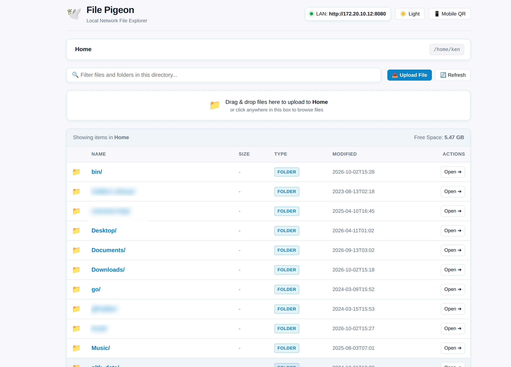

A fast, lightweight web app for exploring, uploading, and downloading
files inside local networks, Wi-Fi intranets, and home labs.



Imagine this, you don't have a USB stick (or an extra USB disk) at hand,
and you want to sync files from one device (a computer, a phone, etc.)
to another, and you want a dead simple solution, File Pigeon is right
for you.

# Features

- **Directory Browsing**: Defaults to serving the user's home directory,
  displaying both folders and files.
  - Seamlessly click into directories to change the listing directory,
    with `.. (Parent Directory)` navigation.
  - Interactive breadcrumb trail for instant jump navigation.
  - Client-side instant filter to quickly find files and folders in the
    current directory.
  - Canonical path validation ensuring access stays safely within the
    configured root directory.
- **Downloads**: Direct file download links with content-disposition and
  automatic MIME type detection.
- **Uploads**: Drag-and-drop dropzone to upload files directly into the
  currently viewed directory.
- **QR Codes**:
  - Rendered in terminal with Unicode half-block characters on server
    startup for instant phone connection.
  - Interactive mobile QR modal on the Web dashboard.
- **LAN Auto-Discovery**: Automatically detects local network IPv4
  interfaces (`wlan`, `eth`, etc.) and prints accessible LAN URLs.

# Command Line Options

``` text
-p, --port PORT  8080         Port to listen on (or via PORT env var)
-H, --host HOST  0.0.0.0      Host interface to bind on (0.0.0.0 for LAN access)
-d, --dir DIR    $HOME        Directory for browsing and sharing files (defaults to home directory)
    --no-qr                   Suppress terminal QR code display
-h, --help                    Display usage information
```

# Getting Started

Download the jar file, and run it:
`java -jar /path/to/file-pigeon-0.1.0-SNAPSHOT-standalone.jar`

# Development

## Prerequisites

Ensure you have either **Clojure CLI** (`clojure` / `clj`) or
**Leiningen** (`lein`) installed with Java 11+.

## Running the Server

Using Leiningen:

``` bash
lein run
# Or, with custom port and directory
lein run -- -p 9090 -d /path/to/folder
```

Using Clojure CLI:

``` bash
clojure -M:run
```

## Building

`lein uberjar`

## RESTful API Endpoints

| Method | Path | Description | Response Format |
|----|----|----|----|
| GET | `/?path=...` | Web UI explorer (browses current path) | HTML |
| GET | `/api/status` | Server status, uptime, storage, and LAN IPs | JSON (Cheshire) |
| GET | `/api/files?path=` | JSON list of files & directories with crumbs | JSON (Cheshire) |
| POST | `/api/upload` | Multipart file upload into current directory | JSON (Cheshire) |
| GET | `/download?path=` | Stream or download file from relative path | Binary / Stream |
| GET | `/files/:filename` | Stream or download file by filename or path | Binary / Stream |
| DELETE | `/api/files?path=` | Delete a file from the directory | JSON (Cheshire) |
| GET | `/qr` | PNG QR Code image for the primary LAN address | `image/png` |
| GET | `/qr/text` | Plaintext LAN URL encoded in the QR code | `text/plain` |

## Testing

Run the full test suite with Leiningen:

``` bash
lein test
```

## Tech Stack

- **Ring** (`ring/ring-core`, `ring/ring-jetty-adapter`,
  `ring/ring-defaults`): HTTP abstraction and high-performance embedded
  Jetty web server.
- **Compojure** (`compojure/compojure`): Elegant, concise routing
  library for endpoints.
- **Cheshire** (`cheshire/cheshire`): Fast JSON encoding and decoding
  for the REST API.
- **ZXing** (`com.google.zxing`): QR code generator for console ANSI
  display and PNG HTTP endpoints.
- **Vanilla HTML5 / CSS3 / JS**: Clean, responsive, self-contained UI
  with zero external CDN dependencies (works completely offline on local
  intranets).
